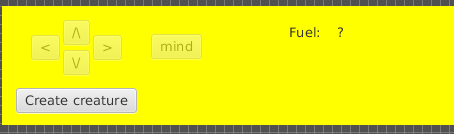

**Aluno**: Ricardo Keigo de Sales Andrade

**Disciplina**: IA941A - Prof. Ricardo Gudwin

**Período**: 1o Semestre de 2018

# Relatório da Aula 1

## RESUMO

Para rodar o código desta aula, basta abrir a pasta *aula1* no terminal e executar: `./run.sh`

A tela do World Server irá aparecer e, 3 segundos depois, a tela da interface de controle da criatura virtual.

Para iniciar, é necessário clicar no botão "Create creature", que irá inicializar uma criatura próxima ao canto superior esquerdo do mundo virtual e habilitar os demais controles. A criatura pode ser então movimentada clicando nos botões com as setas direcionais e a tela da mente pode ser aberta clicando-se no botão "mind".

## Introdução

Este é o relatório referente à atividade proposta na primeira aula do curso.

Todo o conteúdo deste relatório (texto e imagens), assim como o código-fonte produzido durante a execução desta atividade, encontram-se disponíveis no seguinte repositório de acesso público:

https://github.com/papeldeorigami/ia941

Por conter submodulos (ws3d, WS3DProxy), recomenda-se fazer clone do repositório com o seguinte comando:

```
git clone --recursive https://github.com/papeldeorigami/ia941
```

Neste relatório, serão feitas referências ao repositório acima com a denominação de _repositório de trabalho_.

## Pré-requisitos:

* Sistema operacional: (K)Ubuntu 16.04 64bit
* Oracle Java JDK version "1.8.0_161 ou compativel

## Atividade 1: Contato com o website da Disciplina

A aula foi disponibilizada no seguinte endereço:
http://faculty.dca.fee.unicamp.br/gudwin/courses/IA941/aula1

A página apresenta os objetivos da aula e os detalhes para a sua execução. Segue uma transcrição dos objetivos:
> * Contato com o Web-site da disciplina
> * Download do Código do Ambiente Virtual que iremos utilizar em nossos trabalhos e sua compilação no Netbeans
> * Geração de um Controlador Manual para o Ambiente Virtual

Com as explicações apresentadas nesta aula, foi gerada a seguinte ilustração, representando a interação com o World Server utilizando o WS3DProxy:


## Atividade 2: Download e Compilação do Código do WorldServer3D

Para facilitar a reprodução deste trabalho em outros computadores, o ws3d foi baixado como submodulo dentro do _repositório de trabalho_.

```
> git submodule add https://github.com/CST-Group/ws3d.git
Cloning into 'ws3d'...
remote: Counting objects: 557, done.
remote: Total 557 (delta 0), reused 0 (delta 0), pack-reused 557
Receiving objects: 100% (557/557), 17.58 MiB | 1.77 MiB/s, done.
Resolving deltas: 100% (255/255), done.
Checking connectivity... done.
```

Em seguida, o código-fonte foi aberto no Netbeans e compilado com sucesso.

## Atividade 3: Geração de um Controlador Manual para o Ambiente Virtual

Transcrição: 

> ...desenvolveremos um template de um sistema de controle de uma criatura virtual, para gerar um controlador manual que possa operar uma criatura no WS3D, e da mesma maneira geraremos uma Aplicação Java com esse controlador.

> ...deve ser enviado ao professor, via e-mail, um arquivo ZIP contendo o seguinte:
> * Código Fonte (Java) da aplicação de controle manual do WS3D
> * Código Executável (arquivo JAR) com sua versão compilada do WS3D
> * Código Executável (arquivo JAR) com sua versão compilada da aplicação de controle manual do WS3D
> * Arquivo Shell Script (BASH) com os comandos para executar o WS3D e em seguida a App de controle manual
> * Arquivo PDF com um relatório das atividades executadas na aula. 

### Gerando o JAR do WS3DProxy

Seguindo as instruções da atividade, para abstrair os detalhes operacionais do uso de sockets, foi feito o download da biblioteca WS3DProxy
> git submodule add https://github.com/CST-Group/WS3DProxy

Em seguida, o projeto foi compilado no Netbeans, o que resultou no _jar_ *WS3DProxy.jar*

### Criando a aplicação de controle

Como linha de estudo, dividiu-se o desafio proposto nas seguintes etapas:
1. Executar e entender o exemplo de codigo de aplicação de controle
2. Estudar as possibilidades do ws3d para desenhar uma interface de controle
3. Definição da arquitetura da interface de controle da criatura
4. Implementar a tela principal
5. Implementação de uma classe Facade para iteragir com o World
6. Movimentar a criatura

_Etapa 1: entendimento do exemplo_

Criou-se um pequeno projeto, com uma classe Main, que simplesmente executa o código de exemplo fornecido na página da disciplina.

O trecho abaixo inicia o proxy que simplifica o acesso ao ws3d:
```
        WS3DProxy proxy = new WS3DProxy();
```

Em seguida, obtém-se uma instância do modelo World e reseta-se o cenário:
```
     World w = World.getInstance();
     w.reset();
```

Por fim, criam-se comidas, criaturas, e obtem-se informações sobre o mundo:
```
     World.createFood(0, 350, 75);
     World.createFood(0, 100, 220);
     World.createFood(0, 250, 210);
     Creature c = proxy.createCreature(100,450,0);
     c.start();
     WorldPoint position = c.getPosition();
     double pitch = c.getPitch();
     double fuel = c.getFuel();
     c.moveto(V_SPEED, V_X, V_Y);
```

*Nota*: Para executar o exemplo, é necessário, pelo menos, apagar a última linha (c.moveto) porque ela é apenas um esqueleto de código, incompleto.

_Etapa 2: possibilidades do ws3d_

Não foi encontrada uma lista de funcionalidades ou artigo de introdução ao ws3d, por isso, para entender o que é possível se fazer com a ferramenta, o caminho escolhido foi estudar o código do WS3DProxy e consultar o próprio ws3d quando necessário.

Entre outros, na pasta *model*, podem-se encontrar os seguintes elementos:
* Creature
* Bag
* World
* 
* ... entre outros.

Alem do que esta definido na pasta model, existe a possibilidade de se criar:
* Food
* TradePoint

Para iteragir com a criatura, pode-se, entre outros:
* mostrar o que está na Bag
* mostrar o campo de visao
* esconder maçã, comer maçã
* guardar jóia
* emocoes
* energia

A interface de controle poderia apresentar uma imagem da criatura, junto com botões para se controlar o movimento, abrir a sacola, trocar leaflets, etc.

O mockup abaixo ilustra o básico que poderia ser feito:


_Etapa 3: Arquitetura da interface_

Para a implementação da interface gráfica, selecionou-se o framework JavaFX, que tem ótimo suporte na IDE NetBeans.

Na pasta aula1, utilizando o NetBeans, foi criado um projeto JavaFX chamado *aula1* cuja classe principal se chama *Aula1*.
O _jar_ *WS3DProxy* foi copiado para a pasta *lib* deste projeto e acrescentado como biblioteca do projeto Aula1, assim como o json.jar requerido para a sua execução.

Inspirado no padrão de projetos MVC (Model-View-Controller), cada tela terá uma View (V) definida em arquivos .fxml (junto com as respectivas folhas de estilo em .css e demais recursos, como imagens) e um Controller (C) de mesmo nome. Esses arquivos são organizados dentro de pacotes com o nome da tela. Por exemplo, a tela MainScreen fica no pacote "mainscreen", e dentro desse pacote, estão os arquivos mainScreen.fxml, mainscreen.css e MainScreenController.java. Os Models (M) ficam em uma pacote dedicado a models, por sua natureza mais reutilizável.

_Etapa 4: Implementar a tela principal_

Utilizando o JavaFX Scene Builder, implementou-se a View mainScreen.fxml, conforme a imagem abaixo:


Quando o botão "Create creature" for pressionado, os demais controles serão habilitados.


_Etapa 5: Implementação do world facade_

Criamos um Model especial para iteração com o ws3d, chamado WorldFacade. Este Model cria uma instancia do WS3DProxy para iteração com o World Server e guarda o estado dos objetos criados, simplificando a utilização da biblioteca.

Para essa classe, criamos um teste unitário que serviu para validar a interação com o WorldServer durante o desenvolvimento.

_Etapa 6: Movimentação da criatura_

O model Creature apresenta um método chamado _move_, que requer os vetores vr e vl, representando a velocidade linear das rodas direita e esquerda, respectivamente.
Utilizando o teste unitário, avaliou-se o comportamento da criatura a esse comando.


### Criando um script de execucao

Para simplificar a execução do código, foi criado um script chamado run.sh que abre o ws3d e a aplicação de controle.
Este script está salvo na pasta raiz da aula1 com permissão de execução. Portanto, no linux, basta chamar o comando:
```
./run.sh
```

Este script abre uma janela com o WS3D, aguarda 3 segundos para que o WS3D inicialize e abre a aplicação de controle.


