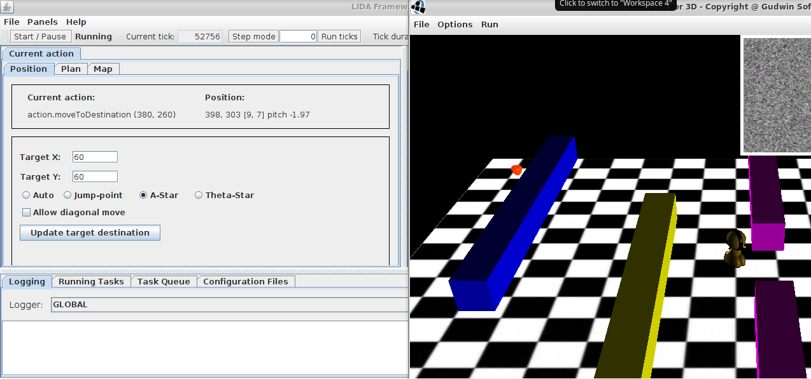
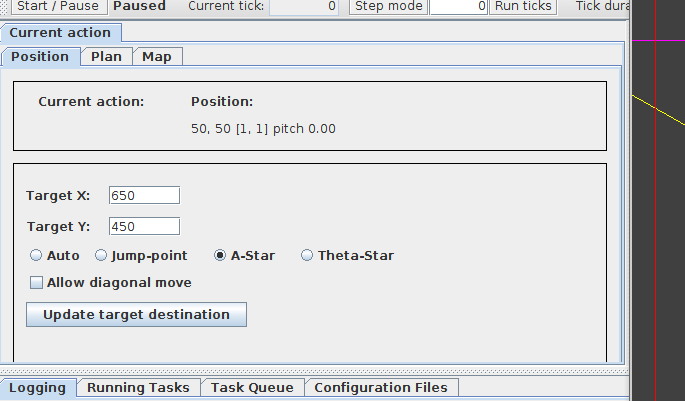
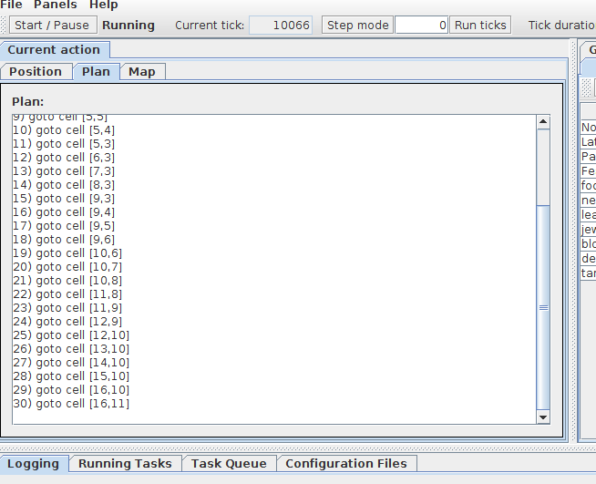
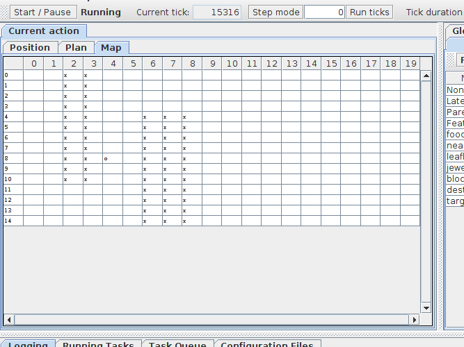

**Aluno**: Ricardo Keigo de Sales Andrade

**Disciplina**: IA941A - Prof. Ricardo Gudwin

**Período**: 1o Semestre de 2018

# Aula 13 - LIDA controlando o WorldServer3D

O codigo-fonte das atividades desenvolvidas pelo aluno encontra-se disponivel em:
https://github.com/papeldeorigami/ia941

Para executar o programa desenvolvido nesta atividade, basta entrar na pasta e executar:
```
./run.sh
```

Segue uma imagem do programa em execução:



Basta apertar o botão "Start" da GUI do Lida que a criatura já vai procurar um caminho para chegar no objetivo, evitando obstaculos, planejando com um algoritmo de pathfinding (A* entre outros).

Para facilitar a visualização, uma maçã é criada no ponto determinado para onde a criatura tem que andar.

Para setar um novo ponto, basta ir na aba "Position", mudar os parametros da busca e apertar "Update target destination".



Também foi introduzida uma aba onde se pode visualizar o plano da criatura:



Por fim, na aba Map, pode-se visualizar o grid que representa o mundo para o algoritmo de pathfinding. O "x" indica obstáculo, e a letra "o" indica a posição atual da criatura.




## Atividade 1

O DemoLida foi baixado através do link indicado na página da disciplina. Seu código foi estudado.

## Atividade 2

A janela do Lida foi habilitada com a propriedade lida.gui.enable=true.

Foi implementado um painel que exibe a acao selecionada atualmente. Para desenvolver esse painel, tomou-se como base o código de um painel do lida-framework, disponivel aqui:
[https://github.com/CognitiveComputingResearchGroup/lida-framework/blob/master/src/edu/memphis/ccrg/lida/framework/gui/panels/ActionSelectionPanel.java]

O painel desenvolvido contém um jLabel cujo texto é atualizado com a primeira acao selecionada.
```
public class CurrentActionPanel extends GuiPanelImpl implements
        ActionSelectionListener {
```
...
```
   @Override
    public void receiveAction(Action action) {
        ActionDetail detail = new ActionDetail(TaskManager.getCurrentTick(),
                currentSelectionCount++, action);
        synchronized (this) {
            selectedActions.addFirst(detail);
            if (selectedActions.size() > selectedActionsSize) {
                selectedActions.pollLast();
            }
            if (selectedActions.size() > 0) {
                currentActionLabel.setText(selectedActions.getFirst().getAction().getLabel());
            } else {
                currentActionLabel.setText("None");
            }
        }
    }
```

Depois, configuramos o painel no guiPanels.properties:
```
# ____A Section____
currentAction=Current action,gui.panels.CurrentActionPanel,A,1,Y
```

## Atividade 3

O detector de blocos foi desenvolvido basicamente copiando e colando o detector de joias.
- Criamos um atributo "block" no Environment e no SensoryMemory
- O método updateEnvironment seta o bloco quando está próximo do agente
- O método getState do Environment passa esse bloco quando solicitado pelo SensoryMemory.runSensors
- O método getSensoryContent do SensoryMemory passa o bloco para o BlockDetector
- Desenvolvemos a classe BlockDetector, que retorna o valor de ativação 1 sempre que um bloco é detectado no SensoryMemory
- Configuramos o BlockDetector no Agent.xml e factoryData.xml, seguindo o modelo do JewelDetector.

O problema de se levar o agente a um determinado ponto, desviando de obstáculos, foi dividido nas seguintes etapas:

1 - Modelar o mundo como um grafo, com destino e obstaculos imaginarios
    
- Importamos a biblioteca [https://github.com/xaguzman/pathfinding](pathfinding)
- Definimos um grid com a largura do agente
- Setamos os pontos do grid com parede como "ocupados" (not walkable)

2 - Estabelecer um mecanismo para planejar e estimular a o agente a andar em direcao a um objetivo

- Fazer o agente detectar o "próximo passo": o primeiro elemento do vetor path que está na sensory memory
- Criamos um DestinationDetector

Dentro do Environment, portanto, definimos um atributo "destination", que é inicializado com o targetDestination definido no Environment.
Para o destination, criamos um DestinationDetector. O Environment utiliza o creature.getPosition() para saber se já chegamos no destino. Enquanto não chegar no destino, retorna o próximo passo do plano definido pelo algoritmo de pathfinding e envia o comando move para essa posição.

3 - Deteccao de Destino final alcancado
- Implementamos um TargetReachDetector, que é ativado quando a criatura chega no ponto de destino definido (target destination). A ação, neste caso, é parar a criatura e escrever uma mensagem no console.

4 - Tela de acompanhamento: estendemos o painel da atividade 2 com algumas abas novas para acompanhamento do algoritmo de pathfinding, incluindo uma opção de se escolher o algoritmo e permitir movimentação diagonal.

## Conclusão

Nesta atividade, desenvolvemos um painel no GUI do Lida e um agente capaz de planejar uma rota, desviando de obstáculos, para chegar em um ponto pré-determinado. O painel foi muito útil para visualização e testes do algoritmo de busca.

Apesar da biblioteca de pathfinding selecionada apresentar diversas alternativas de algoritmos (jump-point, A* e Tetha*), somente o A* foi capaz de resolver as diversas situações testadas, pois os outros algoritmos não encontravam caminhos ou acabavam indicando um caminho que levava a um travamento do agente por se aproximar demais de um bloco, apesar da rotina de desvio de obstáculos com rotação implementado nesta atividade.

A abordagem de busca com representação do mundo em um grid apresentou bons resultados, mas ainda tem algumas limitações: não consegue lidar com blocos muito próximos e, eventualmente, o agente fica travado quando vai fazer uma curva. Para lidar com essa limitações, poderia-se tentar outros tamanhos de grid e algumas abordagens reativas, como fazer o agente dar ré e girar, para tentar acertar melhor o caminho em caso de travamento.
