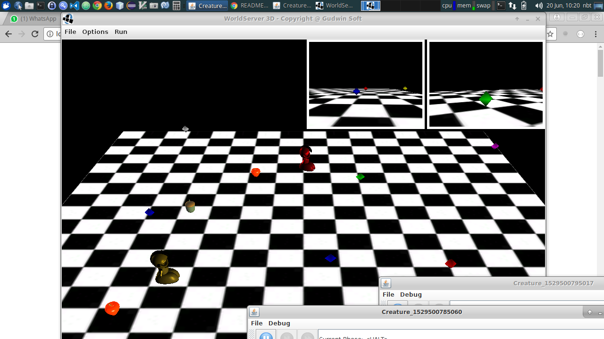

**Aluno**: Ricardo Keigo de Sales Andrade

**Disciplina**: IA941A - Prof. Ricardo Gudwin

**Período**: 1o Semestre de 2018

# Relatório da Aula 6 - SOAR: Controlando o WorldServer3D

## Instruções de uso

Para rodar o código desta aula, basta abrir a pasta *aula6* no terminal e executar: `./run.sh`

A tela do World Server irá aparecer e, 3 segundos depois, o primeiro agente, controlado pelo SOAR, será iniciado.
O segundo agente precisa de mais 10 segundos para ser iniciado, para dar tempo do mundo carregar.
O título da janela do MindViewer foi modificado para indicar o nome de cada agente, assim pode-se acompanhar mais de perto o que cada um está fazendo.


Outros agentes podem ser iniciados, na pasta DemoJSOAR, diretamente pelo comando: `java -jar ./dist/DemoJSOAR.jar no-reset`. Esse último parâmetro, no-reset, indica que o programa Java não deve chamar o método World.reset(), mantendo o ambiente já criado.

Segue uma imagem da tela do programa em execução.



### Código-fonte

Todo o conteúdo deste relatório (texto e imagens), assim como o código-fonte produzido durante a execução desta atividade, encontram-se disponíveis no seguinte repositório de acesso público:

https://github.com/papeldeorigami/ia941

Por conter submodulos (ws3d, WS3DProxy), recomenda-se fazer clone do repositório com o seguinte comando:

```
git clone --recursive https://github.com/papeldeorigami/ia941
```

Neste relatório, serão feitas referências ao repositório acima com a denominação de _repositório de trabalho_.

## Pré-requisitos:

* Sistema operacional: (K)Ubuntu 16.04 64bit
* Oracle Java JDK version "1.8.0_161 ou compativel

## Atividade 1

O programa DemoJSOAR permite a execucao de regras do Soar, interage com o WorldServer3D e apresenta ferramentas de depuração, tais como botões step/mstep, uma visao em forma de árvore do Working Memory, um MindView, etc.

#### _O loop principal de simulação do DemoJSOAR também se encontra na classe Main. Explique seu funcionamento._

A cada iteração, o programa chama o método Step do SoarBridge, que faz o equivalente ao comando step do SoarDebugger, avançando uma fase de cada vez no ciclo de execução do SOAR.
Além disso, no loop, são exibidos no mind view os links de input e output.

#### _Acesse o código da classe SoarBridge.java, para compreender em mais detalhes o que está acontecendo. Investigue o funcionamento dos métodos step() e mstep() dessa classe._

Step e mstep servem para investigar o ciclo de execucao, sendo que o mstep vai uma fase de cada vez, em quanto o step roda um passo completo do Soar.

#### _Observe que essa classe já se utiliza das classes de apoio em WS3DProxy. Entenda e explique como é feito o acesso ao WorldServer3D, por meio do WS3DProxy.__

Um objeto da classe Environment, inicializado pela Main, inicializa uma instancia do WS3DProxy e pega uma instancia para o World. O SoarBridge recebe uma referência ao environment e, à partir daí, iterage com o WorldServer3D, acessando as criaturas, enviando comandos, etc.

#### _Explique como é feita a leitura do estado do ambiente no WorldServer3D, e como esses dados sensoriais são enviado para o SOAR. Da mesma forma, explique como os dados enviados pelo SOAR são aproveitados para controlar a criatura no WorldServer3D. Registre suas conclusões no relatório de atividades._

* O metodo prepareInputLink é responsável por criar os elementos de memória de trabalho (WMEs) relacionados às criaturas, às coisas e aos seus atributos, refletindo o estado do WorldServer3D.

* O processOutputLink processa os comandos de saída do SOAR, controlando o WorldServer3D de acordo.

#### _Acesse o conteúdo do arquivo de regras SOAR: soar-rules.soar e tente entender seu funcionamento. Explique o princípio lógico de seu funcionamento._

Os comportamentos definidos pelas regras podem ser resumidos em:
* __Procurar itens (wander)__: girar em torno de si com VelR=2 (para a esquerda)
* __Enxergar itens (seeEntityWithMemoryCount/seeEntityWithoutMemoryCount)__: atualiza memoria com itens no campo de visao (JEWEL/FOOD)
* __Mover-se para/pegar uma jóia__ (moveJewel/getJewel): caminha na direção da jóia (JEWEL) e pega quando está próximo o suficiente (30)
* __Mover-se para/comer comida__ (moveFood/eatFood): caminha na direção da comida e a consome quando está próxima o suficiente (30) 
* __Evitar paredes (avoidBrick)__: quando se aproxima da parede (61), gira a uma fracao da distância para evitar o obstaculo (55/distancia).

A aplicação das regras associadas a esses comportamentos se dá na ordem definida pelos operadores de __preferência__, no final do arquivo. Podemos resumir as preferências da seguinte forma, em ordem decrescente:
1. Comer, se estiver com combustível baixo
2. Pegar jóia, se estiver com combustível alto
3. Desviar de parede
4. Enxergar objetos
5. Andar na direção de jóias/comida
6. Procurar itens

## Atividade 2
 
Construir um controlador deliberativo, ao invés de reativo, para encontrar as jóias especificadas nos Leaflets da criatura, utilizando as técnicas de Planning aprendidas no tutorial do SOAR.

### Definição da meta ("desired state")

Estamos considerando a mochila do Agente como a variável que temos que trabalhar para chegar ao estado final desejado.
A definição de um estado final desejado, ou meta, é fundamental para a abordagem deliberativa. Na resolução deste exercício, esse estado final é representado pela estrutura "desired" e é calculada através da soma de todas as jóias de cada cor necessárias para completar os 3 leaflets. Ou seja, o agente cumpriu sua missão, e pode trocar os seus leaflets, quando a sua mochila contiver todas as jóias de todos os leaflets.


### Leaflets no SOAR

Para que o SOAR tenha acesso à informação dos Leaflets, estendemos a classe SoarBridge, metodo prepareInputLink, com a seguinte representação, onde cada folha com nome de cor representa o número de jóias necessário para completar aquele leaflet:

```
	CREATURE I4
		^LEAFLETS I8
			^LEAFLET I9
				^PAYMENT 50
				^RED 1
				^GREEN 3
				...
			^LEAFLET I10
				...
```

### Knapsack & desired result

Utilizamos o inicializador para criar um knapsack na criatura; desta forma, podemos contar quantas jóias de cada cor ela está carregando.

Sendo assim, o resultado esperado (^desired) ficou sendo a soma de cada cor dos três leaflets, como demonstrado no trecho abaixo do initialize-solution:

```
   (<desired>
               ^Red (+ <Red1> <Red2> <Red3>)
               ^Green (+ <Green1> <Green2> <Green3>)
               ^Blue (+ <Blue1> <Blue2> <Blue3>)
               ^Yellow (+ <Yellow1> <Yellow2> <Yellow3>)
               ^Magenta (+ <Magenta1> <Magenta2> <Magenta3>)
               ^White (+ <White1> <White2> <White3>))
```

### Operadores

Foram definidos os seguintes operadores principais, com suas respectivas elaborações e sub-estados:
- plan: planejar o próximo movimento que ajude a atingir o desired state
- move: andar para o destino planejado
- see: salvar em memoria qualquer novo objeto visto
- get: sempre que encontrar alguma joia próxima, que sirva para completar algum leaflet, pegar
- hide: sempre que encontrar alguma jóia próxima, que não seja necessária para algum leaflet, esconder
- eat: sempre que encontrar comida proxima, comer
- wander: quando não há nada a buscar, o agente fica girando
- success: quando o estado desejado é atingido, o programa exibe uma caixa de diálogo

### Elaborations

Para simplificar a lógica dos operadores, foram introduzidas ainda algumas elaborações, dentre elas:
- all-leaflets-complete: checa quando o knapsack contém todas as jóias dos leaflets e augmenta o estado com o atributo de mesmo nome
- thing-ahead: checa se existe algum objeto a menos de 30 unidades de distância
- distance-to-waypoint-0: indica a distância a ser percorrida para mover o agente ao primeiro ponto da rota planejada

### Detalhes de implementação

* Para simplificar um pouco o código, criou-se uma regra de inicialização da criatura. Desta forma, pode-se inicializar contadores de jóias, eliminando a necessidade de rotinas duplicadas, tais como a see\*entity, que tinha duas versões (see\*entity\*with\*memory\*count e see\*entity\*without\*memory\*count).

* Foi introduzido ainda um operador de simulação (simulate-input) para permitir o desenvolvimento de código SOAR sem o Java. Isto é, simulou-se todos os inputs relevantes do WS3D, permitindo-se utilizar o SoarJavaDebugger diretamente, sem a necessidade de se iniciar o programa Java para verificar os resultados.

* Utilizou-se o VisualSoar para se organizar melhor o código, com um arquivo para cada operador, permitindo ainda a verificação de sintaxe no próprio editor. Para abrir o código no VisualSoar, basta acessar o arquivo "rules/solution.vsa".

### SoarBridge com memória persistente

Para poder fazer a ponte com o JSoar sem que ele fosse reiniciado toda vez, zerando a memória, utilizamos a classe InputBuilder para definir os WMEs. Essa classe permite pegar a referência aos elementos de Input criados anteriormente, evitando a duplicação de WMEs.

Alterações realizadas no arquivo SoarBridge:
```
    public SoarBridge(Environment _e, String path, Boolean startSOARDebugger) 
    {
            ...
            builder = InputBuilder.create(agent.getInputOutput());
            inputLink = builder.io.getInputLink();
    ...

    private void prepareInputLink() {
        InputBuilder creatureSensor;
    
        ....

        clearInputLink();
        Creature c = env.getCreature();
        try {
            if (agent != null) {
                creature = builder.push("CREATURE").markWme("CREATURE");
                creature.push("MEMORY");
    ...

    private void clearInputLink() {
        InputWme inputCreature;
        inputCreature = builder.getWme("CREATURE");
        if (inputCreature != null)
            inputCreature.remove();
    }
```

### Busca do melhor caminho

No SoarBridge, implementou-se a ação PLAN, que essencialmente é constituida de uma rotina que busca a melhor rota para preencher os 3 leaflets.
Essa sequencia de busca é salva no input-link e o SOAR utiliza o primeiro ponto (WAYPOINT-0) para a operação de Move.

Toda vez que um novo objeto é visto, capturado, escondido, etc (i.e. provoque mudanças no ambiente), o planejamento é refeito. Da mesma forma, quando nenhum operador MOVE é selecionado, o agente também dispara um planejamento.
Se nenhum plano existir, o operador Wander entra em ação, para tentar enxergar novas jóias.

A listagem abaixo é a parte principal da implementação dessa busca pela melhor rota:
```
    /**
     * Draw the shortest path to complete all leaflets
     */
    private void rebuildPlan() {
        HashMap<String, List<ThingWithDistance>> jewelListSortedByDistanceGroupedByColor = new HashMap<>();
        HashMap<String, Integer> jewelsNeededGroupedByColor = new HashMap<>();
        plan.clear();
        // build a map of all available things, sorted by distance and grouped by color
        for (Thing thing: thingsMemory) {
            if (thing.getCategory() == Constants.categoryJEWEL) {
                String color = Constants.getColorName(thing.getMaterial().getColor());
                List<ThingWithDistance> sortedList = jewelListSortedByDistanceGroupedByColor.get(color);
                if (sortedList == null) {
                    sortedList = new ArrayList<>();
                }
                double distance = c.calculateDistanceTo(thing);
                if (distance <= 30) {
                    continue;
                }
                ThingWithDistance thingWithDistance = new ThingWithDistance(thing, distance);
                sortedList.add(thingWithDistance);
                sortedList.sort(Comparator.comparing(ThingWithDistance::getDistance));
                jewelListSortedByDistanceGroupedByColor.put(color, sortedList);
            }
        }
        // build a map of all jewels needed, with total quantity grouped by color
        jewelsNeededGroupedByColor.put("Red", 0);
        jewelsNeededGroupedByColor.put("Green", 0);
        jewelsNeededGroupedByColor.put("Blue", 0);
        jewelsNeededGroupedByColor.put("Yellow", 0);
        jewelsNeededGroupedByColor.put("Magenta", 0);
        jewelsNeededGroupedByColor.put("White", 0);
        for (Leaflet l : c.getLeaflets()) {
            HashMap<String, Integer[]> items = l.getItems();
            for (HashMap.Entry<String, Integer[]> entry : items.entrySet()) {
                String color = entry.getKey();
                Integer needed = entry.getValue()[0];
                Integer collected = entry.getValue()[1];
                Integer previousNeeded = jewelsNeededGroupedByColor.get(color);
                if (previousNeeded != null) {
                    needed += previousNeeded;
                }
                jewelsNeededGroupedByColor.put(color, needed - collected);
            }
        }
        // build a map of nearest jewels needed to complete all leaflets
        List<ThingWithDistance> sortedListOfNeededThings = new ArrayList<>();
        for (String color: jewelsNeededGroupedByColor.keySet()) {
            int needed = jewelsNeededGroupedByColor.get(color);
            List<ThingWithDistance> availableJewels = jewelListSortedByDistanceGroupedByColor.get(color);
            if (availableJewels == null) {
                continue;
            }
            if (needed > 0) {
                for (int i = 0; (i < needed) && (i < availableJewels.size()); i++) {
                    sortedListOfNeededThings.add(availableJewels.get(i));
                    sortedListOfNeededThings.sort(Comparator.comparing(ThingWithDistance::getDistance));
                }
            }
        }
        // build the plan
        for (ThingWithDistance thingWithDistance: sortedListOfNeededThings) {
            Thing thing = thingWithDistance.getThing();
            plan.add(thing.getCenterPosition());
        }
    }
```

## Conclusão

O programa desenvolvido utiliza raciocínio deliberativo para atingir o objetivo de trocar leaflets por pontos.
Foram colocados dois agentes em execução simultaneamente para observar melhor o comportamento deles.

Uma melhoria possível seria considerar a pontuação de cada leaflet para determinar a sequência das jóias a serem capturadas.

Também seria possível a introdução de algoritmos de menor caminho, como A-star, para a busca de jóias, desviando-se inclusive de obstáculos.

Além disso, os agentes precisam ser modificados para lidar melhor com mudanças de ambiente, tais como uma jóia que foi capturada pelo outro agente ou obstáculos fora do campo de visão (jóias travam o agente "de lado").


