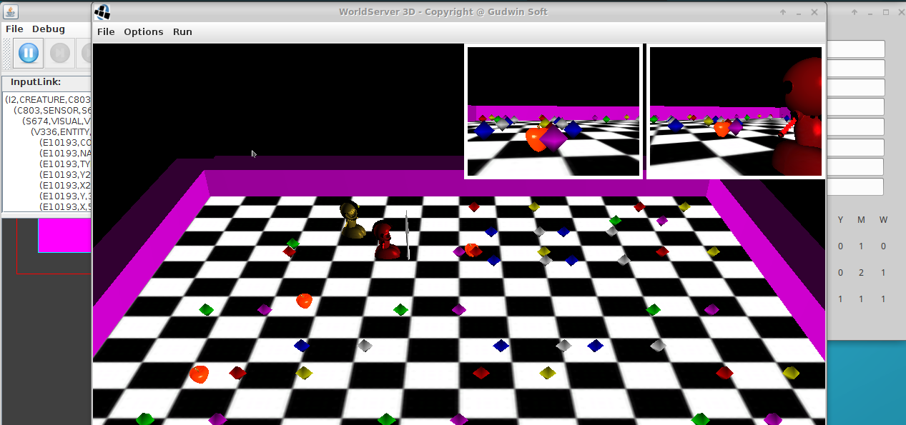

**Aluno**: Ricardo Keigo de Sales Andrade

**Disciplina**: IA941A - Prof. Ricardo Gudwin

**Período**: 1o Semestre de 2018

# Relatório da Aula 9 - Clarion: Controlando o WorldServer3D

## Instruções de uso

Para rodar o código desta aula, basta abrir a pasta *aula9* no terminal e executar: `./run.sh`

Para rodar junto com o agente soar: `./run_with_soar.sh`

A tela do World Server irá aparecer e, 3 segundos depois, o controlador Clarion será executado automaticamente, iniciando a busca pelas jóias. O agente SOAR aparece alguns segundos depois, caso se tenha optado por esse script.



## Descrição do código

Nesta atividade foi desenvolvido um controlador para um agente capaz de pegar todas as jóias indicadas em seus leaflets e parar depois disso.

A abordagem escolhida foi adaptar o programa DemoClarion, ainda utilizando ACS, e alterando o SensoryInput para direcionar as decisões do agente.

Antes de partir para essa abordagem, tentou-se selecionar a ação através de um peso diferente para cada FixedRule, mas não foi possível determinar o setup adequado para que esse peso fosse levado em conta na decisão do agente. Tentou-se ainda refinar os parâmetros relacionados a Selection Threshold e Beta de FixedRule Variavel, mas nenhuma dessas abordagens levou ao resultado desejado. Por isso, optou-se por controlar o input sensorial.

A principal modificação foi no método prepareSensoryInformation, onde se estabeleceu a priorizacao do input que ira determinar a decisão:
```
			// Add sensorial input with a rule-based prioritization
			if (stopped) {
				// Success, don't do anything else
				si.Add (inputDeliverLeaflet, CurrentAgent.Parameters.MIN_ACTIVATION);
				si.Add (inputWallAhead, CurrentAgent.Parameters.MIN_ACTIVATION);
				si.Add (inputJewelAhead, CurrentAgent.Parameters.MIN_ACTIVATION);
				si.Add (inputFoodAhead, CurrentAgent.Parameters.MIN_ACTIVATION);
				si.Add (inputWallAhead, CurrentAgent.Parameters.MIN_ACTIVATION);
				si.Add (inputDistantFood, CurrentAgent.Parameters.MIN_ACTIVATION);
				si.Add (inputDistantJewel, CurrentAgent.Parameters.MIN_ACTIVATION);
			} else if (checkThreeLeafletsReady()) {
				// Time to deliver
				si.Add (inputDeliverLeaflet, CurrentAgent.Parameters.MAX_ACTIVATION);
				si.Add (inputWallAhead, CurrentAgent.Parameters.MIN_ACTIVATION);
				si.Add (inputJewelAhead, CurrentAgent.Parameters.MIN_ACTIVATION);
				si.Add (inputFoodAhead, CurrentAgent.Parameters.MIN_ACTIVATION);
				si.Add (inputWallAhead, CurrentAgent.Parameters.MIN_ACTIVATION);
				si.Add (inputDistantFood, CurrentAgent.Parameters.MIN_ACTIVATION);
				si.Add (inputDistantJewel, CurrentAgent.Parameters.MIN_ACTIVATION);
			} else if (jewelAhead || foodAhead) {
				// Prioritize actions that don't require move: eat food, get jewel or deliver leaflet
				double jewelAheadActivationValue = jewelAhead ? CurrentAgent.Parameters.MAX_ACTIVATION : CurrentAgent.Parameters.MIN_ACTIVATION;
				double foodAheadActivationValue = foodAhead ? CurrentAgent.Parameters.MAX_ACTIVATION : CurrentAgent.Parameters.MIN_ACTIVATION;
				double deliverActivationValue = deliver ? CurrentAgent.Parameters.MAX_ACTIVATION : CurrentAgent.Parameters.MIN_ACTIVATION;
				si.Add (inputDeliverLeaflet, CurrentAgent.Parameters.MIN_ACTIVATION);
				si.Add (inputJewelAhead, jewelAheadActivationValue);
				si.Add (inputFoodAhead, foodAheadActivationValue);
				si.Add (inputDeliverLeaflet, deliverActivationValue);
				si.Add (inputWallAhead, CurrentAgent.Parameters.MIN_ACTIVATION);
				si.Add (inputDistantFood, CurrentAgent.Parameters.MIN_ACTIVATION);
				si.Add (inputDistantJewel, CurrentAgent.Parameters.MIN_ACTIVATION);
			} else if (wallAhead) {
				// Avoid obstacle
				si.Add (inputDeliverLeaflet, CurrentAgent.Parameters.MIN_ACTIVATION);
				si.Add (inputWallAhead, CurrentAgent.Parameters.MAX_ACTIVATION);
				si.Add (inputJewelAhead, CurrentAgent.Parameters.MIN_ACTIVATION);
				si.Add (inputFoodAhead, CurrentAgent.Parameters.MIN_ACTIVATION);
				si.Add (inputDeliverLeaflet, CurrentAgent.Parameters.MIN_ACTIVATION);
				si.Add (inputDistantFood, CurrentAgent.Parameters.MIN_ACTIVATION);
				si.Add (inputDistantJewel, CurrentAgent.Parameters.MIN_ACTIVATION);
			} else if (needAndHaveFood) {
				// go for food if the creature needs it
				si.Add (inputDeliverLeaflet, CurrentAgent.Parameters.MIN_ACTIVATION);
				si.Add (inputWallAhead, CurrentAgent.Parameters.MIN_ACTIVATION);
				si.Add (inputJewelAhead, CurrentAgent.Parameters.MIN_ACTIVATION);
				si.Add (inputFoodAhead, CurrentAgent.Parameters.MIN_ACTIVATION);
				si.Add (inputDeliverLeaflet, CurrentAgent.Parameters.MIN_ACTIVATION);
				si.Add (inputDistantFood, CurrentAgent.Parameters.MAX_ACTIVATION);
				si.Add (inputDistantJewel, CurrentAgent.Parameters.MIN_ACTIVATION);
			} else if (closestJewel != null) {
				// go for the closest jewel needed for a leaflet
				si.Add (inputDeliverLeaflet, CurrentAgent.Parameters.MIN_ACTIVATION);
				si.Add (inputWallAhead, CurrentAgent.Parameters.MIN_ACTIVATION);
				si.Add (inputJewelAhead, CurrentAgent.Parameters.MIN_ACTIVATION);
				si.Add (inputFoodAhead, CurrentAgent.Parameters.MIN_ACTIVATION);
				si.Add (inputDeliverLeaflet, CurrentAgent.Parameters.MIN_ACTIVATION);
				si.Add (inputDistantFood, CurrentAgent.Parameters.MIN_ACTIVATION);
				si.Add (inputDistantJewel, CurrentAgent.Parameters.MAX_ACTIVATION);
			}
```


As Fixed Rules são as seguintes:
```
        private double FixedRuleToAvoidCollisionWall(ActivationCollection currentInput, Rule target)
        {
            // See partial match threshold to verify what are the rules available for action selection
            return ((currentInput.Contains(inputWallAhead, CurrentAgent.Parameters.MAX_ACTIVATION))) ? 1.0 : 0.0;
        }

		private double FixedRuleToStopWhenFinished(ActivationCollection currentInput, Rule target)
		{
			// See partial match threshold to verify what are the rules available for action selection
			return (checkThreeLeafletsDelivered() && !stopped) ? 1.0 : 0.0;
		}

		private double FixedRuleToGoToClosestJewel(ActivationCollection currentInput, Rule target)
		{
			// Here we will make the logic to go to jewel
			return ((currentInput.Contains (inputDistantJewel, CurrentAgent.Parameters.MAX_ACTIVATION))) ? 1.0 : 0.0;
		}

		private double FixedRuleToGoToClosestFood(ActivationCollection currentInput, Rule target)
		{
			// Here we will make the logic to go to food
			return ((currentInput.Contains(inputDistantFood, CurrentAgent.Parameters.MAX_ACTIVATION))) ? 1.0 : 0.0;
		}

		private double FixedRuleToEatFood(ActivationCollection currentInput, Rule target)
		{
			// Here we will make the logic to eat food
			return ((currentInput.Contains(inputFoodAhead, CurrentAgent.Parameters.MAX_ACTIVATION))) ? 1.0 : 0.0;
		}

		private double FixedRuleToSackJewel(ActivationCollection currentInput, Rule target)
		{
			// Here we will make the logic to sack jewel
			return ((currentInput.Contains(inputJewelAhead, CurrentAgent.Parameters.MAX_ACTIVATION))) ? 1.0 : 0.0;
		}
```

Quando uma jóia que não pertence a um leaflet está bloqueando o caminho, ou um alimento, eles são coletados/digeridos pelo agente.

Quando o combustivel está abaixo de 400, a coleta de alimentos ganha prioridade maior que a de jóias do leaflet.

Quando os três leaflets estão completos, o agente pára e o label de mensagem, que foi acrescentado na parte de baixo da tela da mente, é alterado.


Iniciamos o agente desenvolvido nesta atividade, junto com o agente da aula 6. O agente da aula 6 inicia um pouco depois, mas muitas vezes termina a atividade antes, pois ele inicia uma ação de rotate quando não tem nenhuma jóia, enquanto o a gente Clarion acaba andando reto até encontrar uma parede.

## Conclusão

Nesta atividade foi desenvolvido, em Clarion, um agente capaz de preencher os leaflets e parar. Utilizou-se apenas o ACScom Fixed Rules, mas esta arquitetura permite muitas abordagens diferentes. Por exemplo, poderíamos tentar ajustar metas e utilizar os módulos de aprendizado para criar um agente independente de regras pré-determinadas.
